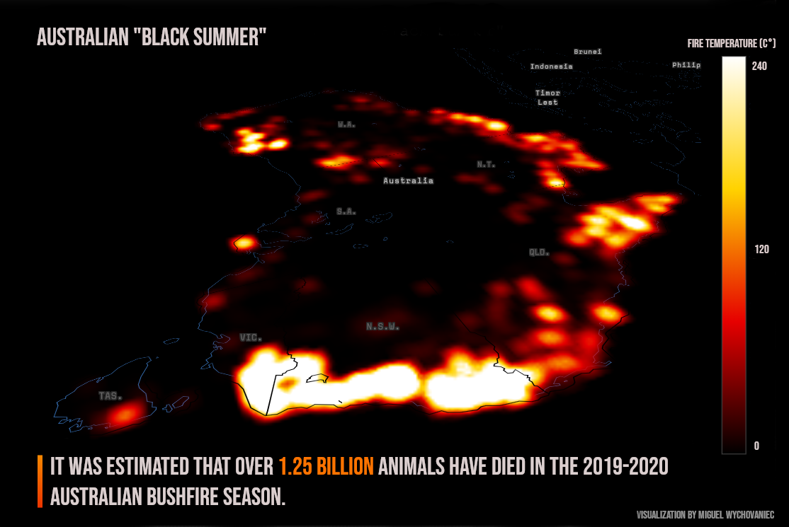
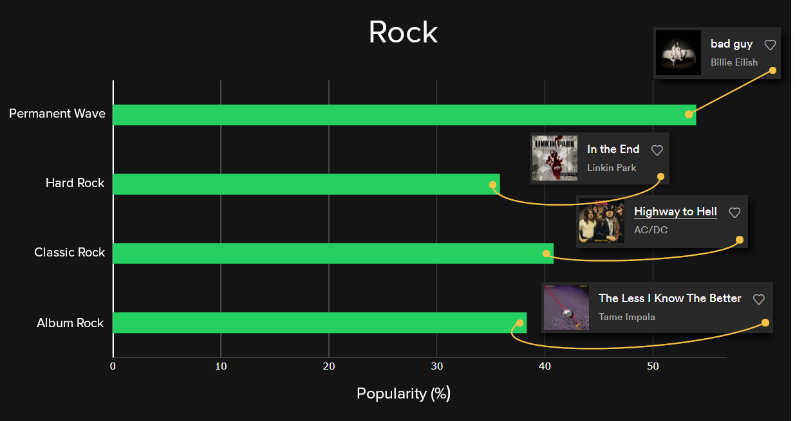
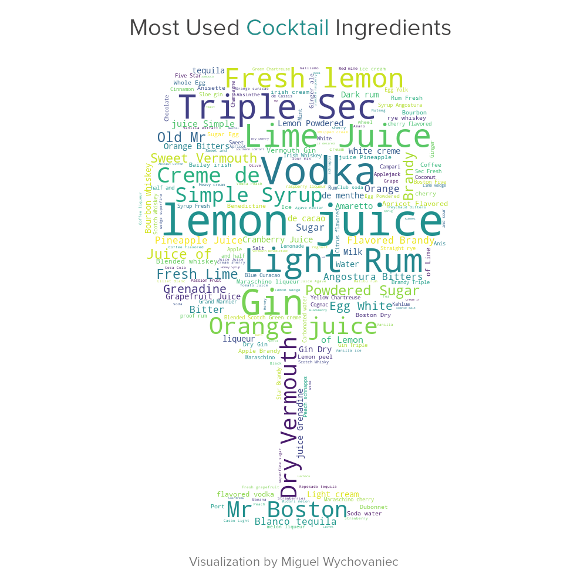
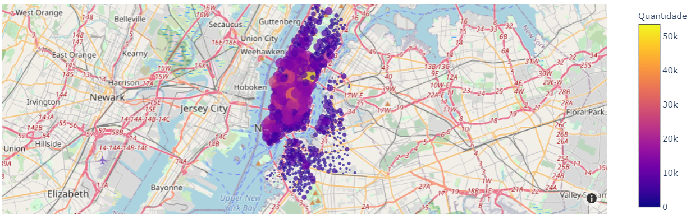
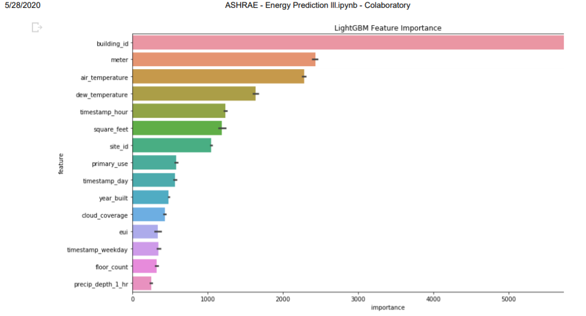

# Miguel Wychovaniec
<h2>Portfolio for some of my data science projects.</h2>

<h3>Data Visualization</h3>

<h4>Australia Bush Fires 2019-2020</h4>

Dataset: https://www.kaggle.com/carlosparadis/fires-from-space-australia-and-new-zeland

Toolbox: Pandas, Plotly.

<h4>Spotify Song Genres (Ongoing)</h4>

Dataset: https://raw.githubusercontent.com/rfordatascience/tidytuesday/master/data/2020/2020-01-21/spotify_songs.csv

Toolbox: Pandas, Plotly.

<h4>Cocktails</h4>

Dataset: https://raw.githubusercontent.com/rfordatascience/tidytuesday/master/data/2020/2020-05-26/cocktails.csv
         https://raw.githubusercontent.com/rfordatascience/tidytuesday/master/data/2020/2020-05-26/boston_cocktails.csv

Toolbox: Pandas, Wordcloud.

<h3>Data Analysis</h3>

<h4>Citi Bike New York Trip Data(Portuguese)</h4>

Dataset: CitiBike 2017 First Semester.

Toolbox: Pandas, Numpy, Seaborn, Plotly, Matplotlib.

Preview: https://htmlpreview.github.io/?https://github.com/miguelwy/DataS/master/dataanalysis/CitiBike/CitiBike2017.html

[Link to HTML file](https://github.com/miguelwy/DataS/blob/master/dataanalysis/CitiBike/CitiBike2017.html)

<h3>Machine Learning</h3>

<h4>ASHRAE - Energy Prediction III</h4>

Best Result in Cross Validation: 0.98 (RMSE)

Dataset: Kaggle.

Toolbox: Pandas, Numpy, Scikit-Learn, LightGBM.

[Link to PDF preview](https://github.com/miguelwy/DataS/blob/master/machinelearning/ASHRAE-EnergyPredictionIII/Preview.pdf)

[Link to Notebook file](https://github.com/miguelwy/DataS/blob/master/machinelearning/ASHRAE-EnergyPredictionIII/ASHRAE_Energy_Prediction_lll.ipynb)

<h4>House Sales in King County, USA</h4>

Best Result R2 Score: 0.88

Dataset: Kaggle.

Toolbox: Pandas, Numpy, Scikit-Learn.

[Link to Notebook file](https://github.com/miguelwy/DataS/blob/master/machinelearning/House Sales in King County, USA/House Sales in King County, USA.ipynb)
