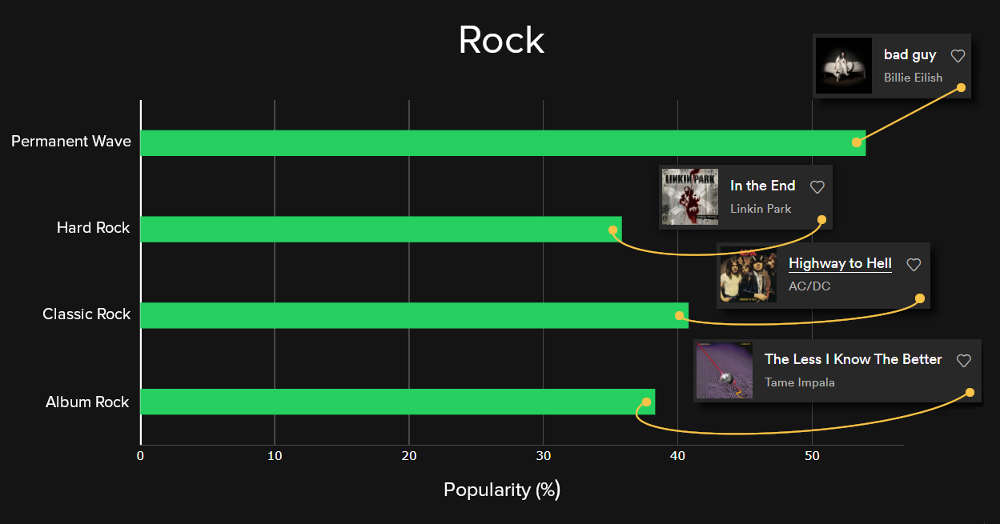

# DataS
<h2>Portfolio for some of my data science projects.</h2>

<h3>Data Visualization</h3>

<h4>Australia Bush Fires 2019-2020</h4>

Dataset: https://www.kaggle.com/carlosparadis/fires-from-space-australia-and-new-zeland

Toolbox: Pandas, Plotly.

<h4>Spotify Song Genres (Ongoing)</h4>

Dataset: https://raw.githubusercontent.com/rfordatascience/tidytuesday/master/data/2020/2020-01-21/spotify_songs.csv

Toolbox: Pandas, Plotly.

