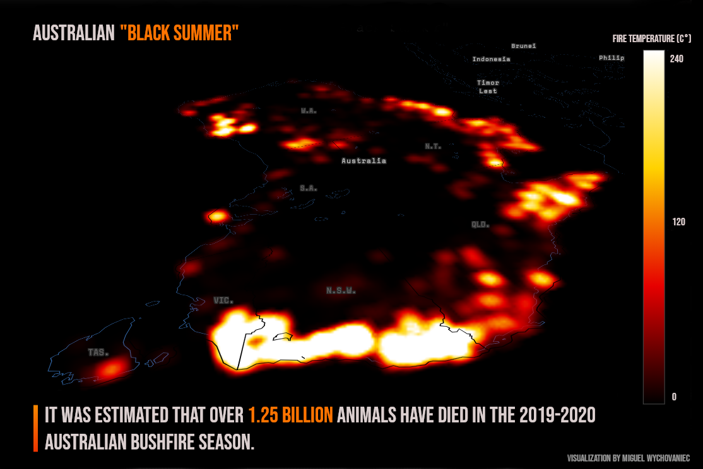
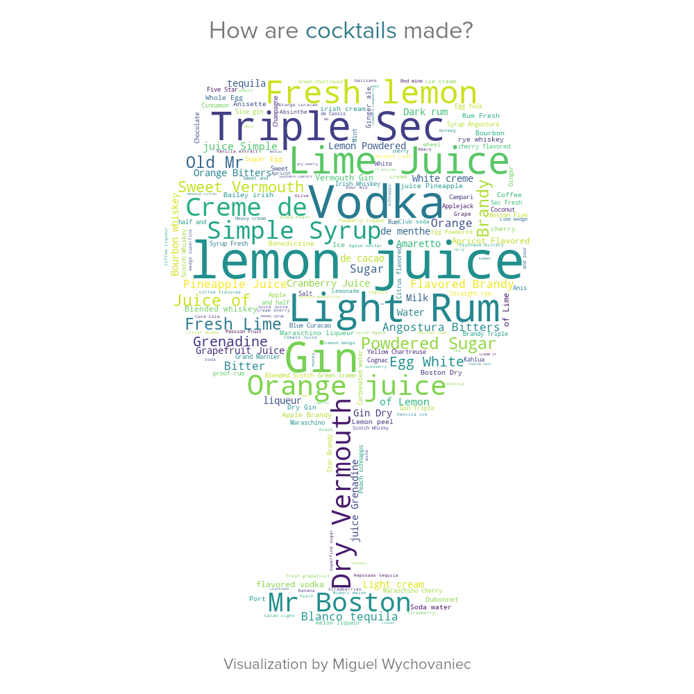

# Miguel Wychovaniec
<h2>Portfolio for some of my data science projects.</h2>

<h3>Data Visualization</h3>

<h4>Australia Bush Fires 2019-2020</h4>

Dataset: https://www.kaggle.com/carlosparadis/fires-from-space-australia-and-new-zeland

Toolbox: Pandas, Plotly.

<h4>Spotify Song Genres (Ongoing)</h4>

Dataset: https://raw.githubusercontent.com/rfordatascience/tidytuesday/master/data/2020/2020-01-21/spotify_songs.csv

Toolbox: Pandas, Plotly.

<h4>Cocktails</h4>

Dataset: https://raw.githubusercontent.com/rfordatascience/tidytuesday/master/data/2020/2020-05-26/cocktails.csv
         https://raw.githubusercontent.com/rfordatascience/tidytuesday/master/data/2020/2020-05-26/boston_cocktails.csv

Toolbox: Pandas, Wordcloud.

<h3>Data Analysis</h3>

<h4>Citi Bike New York Trip Data(Portuguese)</h4>

Dataset: CitiBike 2017 First Semester.

Toolbox: Pandas, Numpy, Seaborn, Plotly, Matplotlib.

Preview: https://htmlpreview.github.io/?https://github.com/miguelwy/DataS/master/dataanalysis/An%C3%A1lise%20Citibike%20Tripdata%20-%201%20Trimestre%202017%20%20-%20Miguel%20Wychovaniec%20(2).html

File: https://github.com/miguelwy/DataS/master/dataanalysis/An%C3%A1lise%20Citibike%20Tripdata%20-%201%20Trimestre%202017%20%20-%20Miguel%20Wychovaniec%20(2).html
